# Data Analysis Report

Based on the analysis of the 'goodreads.csv' dataset, which contains information on 10,000 books, several insights can be drawn regarding the trends, outliers, anomalies, and patterns present in the data.

### Overview of the Dataset

The dataset comprises a variety of attributes related to books, including identification numbers, author names, publication years, ratings, and review counts. Key columns include:

- **Average Rating**: The mean score given to the book.
- **Ratings Count**: The number of ratings a book has received.
- **Work Ratings Count and Work Text Reviews Count**: These provide insights into user engagement and feedback.

### Descriptive Statistics

1. **Average Rating Trends**:
   - The overall average rating across the dataset is approximately 4.00 with a moderate standard deviation of 0.25, indicating that most books tend to receive positive ratings. The ratings range between 2.47 and 4.82, suggesting an overall favorability toward the books in the dataset.

2. **Ratings Distribution**:
   - The average ratings for each score (1-5) indicate that higher ratings tend to have noticeably more counts:
     - **Ratings for 1**: 1345
     - **Ratings for 2**: 3110
     - **Ratings for 3**: 11476
     - **Ratings for 4**: 19966
     - **Ratings for 5**: 23789
   - The significant skew in ratings suggests that users are more inclined to award higher ratings, reinforcing the earlier observation of generally favorable opinions.

3. **Engagement Metrics**:
   - The average **ratings count** stands at approximately 54,001, while the maximum exceeds 4.7 million. The high standard deviation of 157,369 indicates a few books are significantly more popular than others, likely skewing the average.
   - **Work text reviews count** is also notably low (average around 2919) relative to ratings count, which indicates that while books receive many ratings, users may prefer not to leave textual reviews.

4. **Authors**:
   - The dataset includes 4,664 unique authors, with **Stephen King** being the most prominent, appearing 60 times. This suggests that a few authors may dominate the dataset, a common trend in literature where certain authors gain considerable popularity.

### Correlation Insights

1. **Ratings and Work Metrics**:
   - There is a significant negative correlation between the ratings count and several other factors, including **work ratings count** (-0.38) and **work text reviews count** (-0.42). This suggests that books that gather a high number of ratings are not always those that receive comprehensive reviews or additional engagement through work ratings.
   - Conversely, there is a positive correlation between ratings counts and star ratings, with correlation values ranging from 0.72 (1-star) to 0.96 (5-star).

2. **Books Count Versus Ratings**:
   - Interestingly, the **books count** (the number of books an author has) is negatively correlated with average ratings (-0.069) but positively correlated with ratings count (0.32). This points to the possibly overwhelming audience for well-established authors, who may receive varied ratings as their bibliography becomes more extensive.

### Publications Over Time

- The **original publication year** mean is approximately 1982 with a maximum of 2017. This suggests that the dataset includes a wide timeframe of literature, including classic and contemporary works. However, the range from -1750 to recent years may indicate time-related inaccuracies or historical works prioritized in the dataset.
- Only 21 entries are missing for the publication year, indicating relatively complete data in that regard.

### Patterns and Outliers

1. **Extreme Ratings and Reviews**:
   - Books with extraordinarily high counts, such as those exceeding 1 million ratings, are outliers and should be examined for potential marketing strategies or cultural phenomena surrounding them.
   - A few books have notably fewer ratings despite a higher average rating, indicating they may be niche but critically acclaimed.

2. **Language Codes**:
   - Out of 10,000 entries, only 8,916 contain language codes, with **English (eng)** being the most frequent (6341 times). This may limit diversity in the literature represented.

### Missing Values

- The dataset does contain some missing values, particularly for **ISBN**, **ISBN13**, and **original title**, albeit these appear to have minimal impact on further analyses given high counts for other columns that capture similar summary statistics.
- The presence of **language codes** and **original titles** missing values could suggest areas where data completeness should be enhanced.

### Conclusions

The analysis of the 'goodreads.csv' dataset reveals that it generally contains a wealth of highly rated books, with significant discrepancies in user engagement metrics among different titles. Authors such as Stephen King dominate the landscape, while ratings and textual reviews suggest user behaviors towards consuming literature. While the dataset encapsulates an exciting spectrum of literature spanning centuries, there are considerations regarding completeness and representation that can further refine insights into the reading community. Future analyses could explore trends from user engagement in recent years compared to older titles to glean insights into evolving reader preferences.

## Visualizations

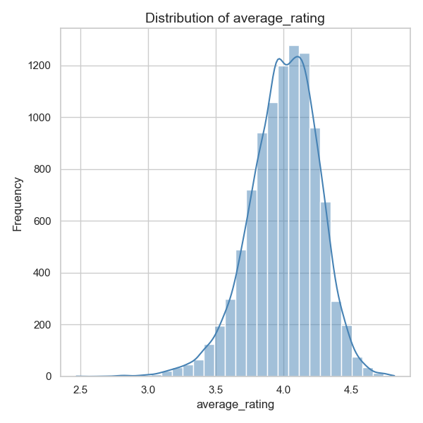
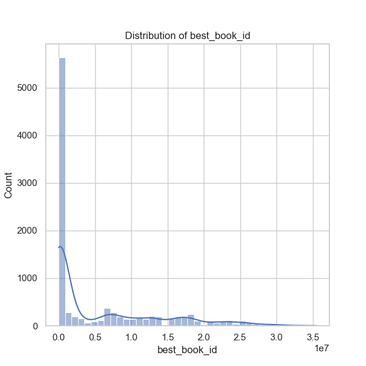
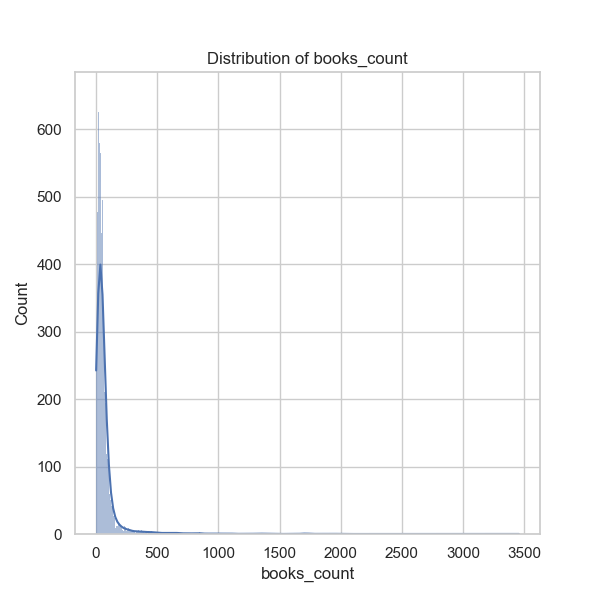
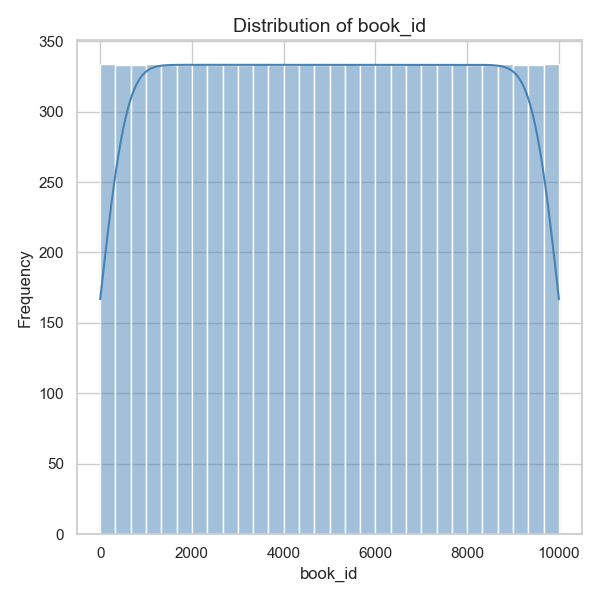
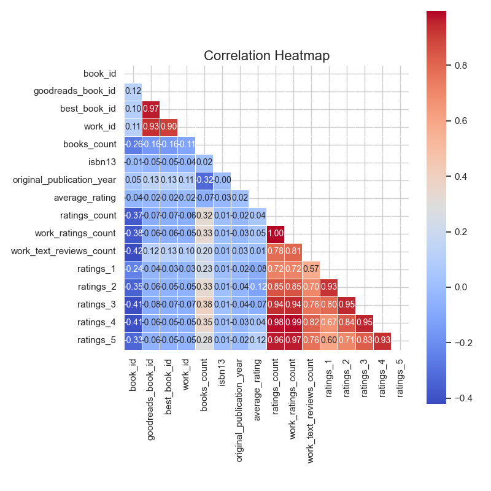
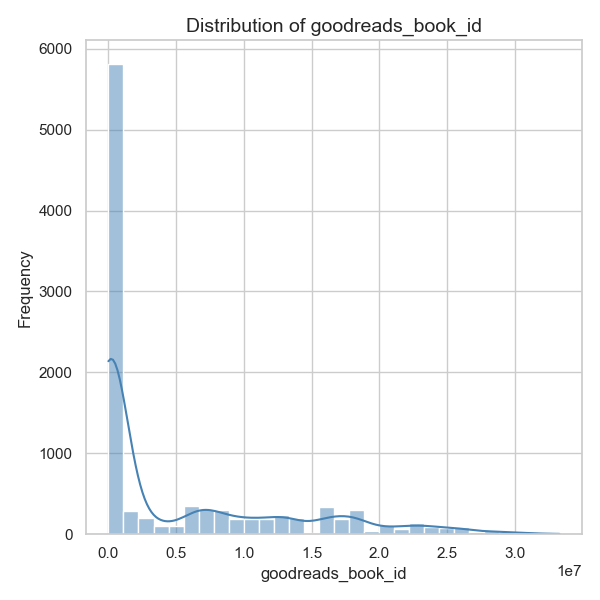
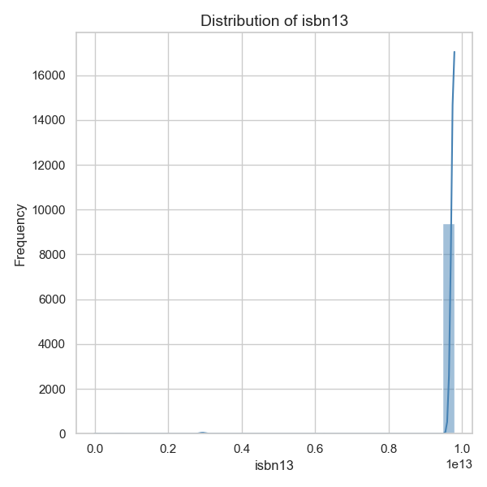
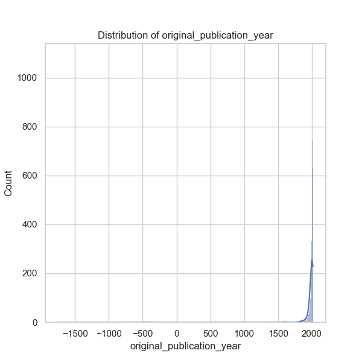
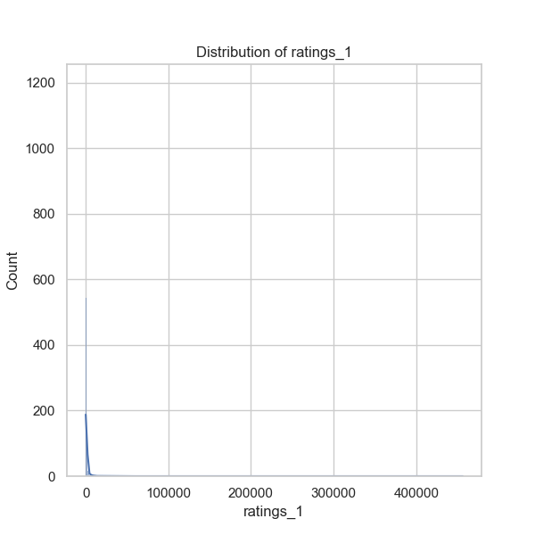
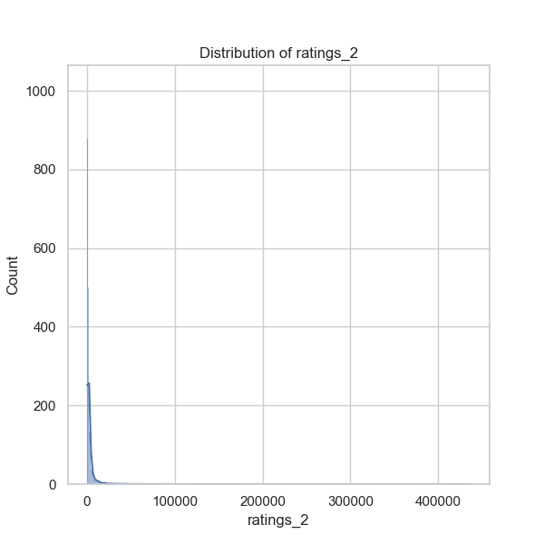
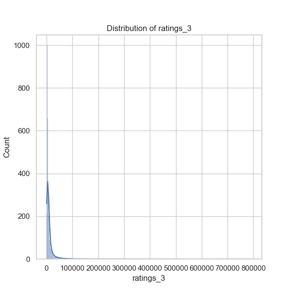
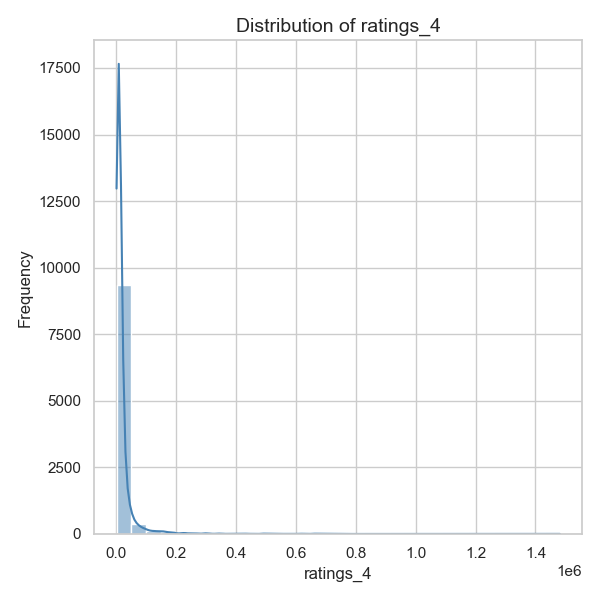
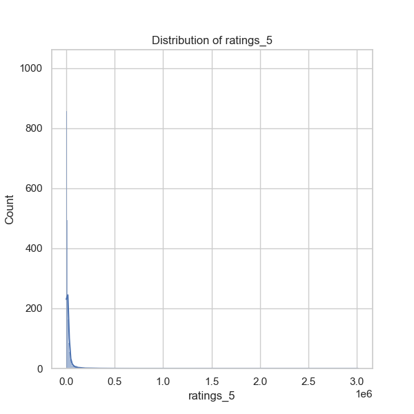

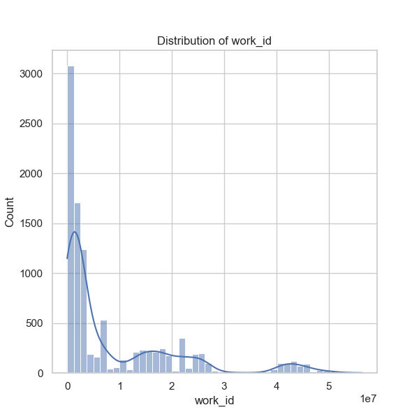
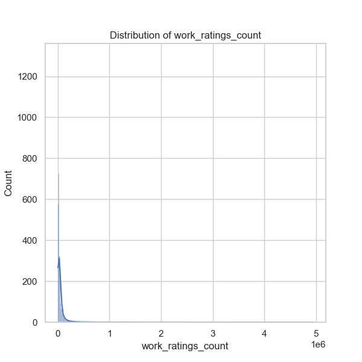
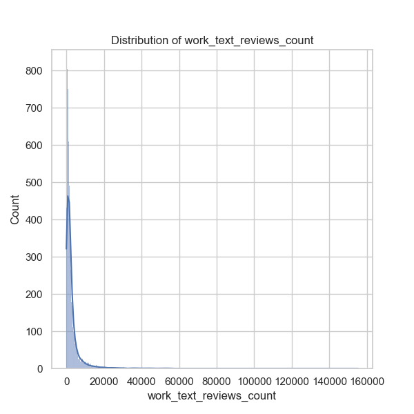