# Data Analysis Report

### Narrative Based on the Analysis of Happiness Data

The dataset 'happiness.csv' encompasses the happiness metrics of 165 countries from 2005 to 2023, with key attributes including the Life Ladder, economic factors, social indicators, and both positive and negative emotional states. In examining this data, several insights, trends, and patterns emerge.

#### Data Overview

1. **Temporal Range and Coverage**: The dataset spans 18 years of data collection, with an average year of approximately 2014.76. The data includes 2363 records of various metrics related to happiness, acknowledging that not all variables are fully populated.

2. **Missing Values**: There are missing values across various attributes:
   - **Log GDP per capita**: 28 missing entries 
   - **Social support**: 13 missing entries 
   - **Healthy life expectancy**: 63 missing entries
   - **Freedom to make life choices**: 36 missing entries 
   - **Generosity**: 81 missing entries 
   - **Perceptions of corruption**: 125 missing entries 
   - **Positive affect**: 24 missing entries 
   - **Negative affect**: 16 missing entries 

   The extent of missing data in attributes like **Generosity** and **Perceptions of corruption** could skew analysis and interpretation of patterns, especially those correlating to overall happiness scores.

#### Summary Statistics and Descriptive Insights

1. **Life Ladder**:
   - Average score is around **5.48**, indicating a moderate level of happiness across the sampled countries.
   - The range (1.281 to 8.019) indicates the existence of both very low and high happiness levels across regions. Countries with low scores may warrant further investigation to understand underlying socio-economic or political factors.

2. **Log GDP per Capita**:
   - The mean is approximately **9.40**, with a maximum of **11.676**. This suggests that higher economic productivity corresponds with happiness levels.
   - However, there is a non-negligible spread (standard deviation around **1.15**), which points to significant disparities in economic wealth across the dataset.

3. **Social Support**:
   - With a mean of **0.809** and a maximum of **0.987**, it indicates that countries with greater social support systems tend to maintain higher happiness levels. 
   - The strong correlation (**~0.72**) with the Life Ladder further highlights its importance.

4. **Healthy Life Expectancy**:
   - The average is **63.40 years**, suggesting a rough standard of healthcare and longevity. 
   - This metric also has a significant correlation with both happiness (Life Ladder) and economic factors (Log GDP).

#### Correlation Analysis

- **Strong Correlations**:
  - There are substantial correlations among the key indicators:
    - **Log GDP per capita** vs **Life Ladder**: **0.78**
    - **Life Ladder** vs **Social Support**: **0.72**
    - **Life Ladder** vs **Healthy Life Expectancy**: **0.71**
    - The findings suggest that improving economic conditions and social support can significantly elevate happiness scores.

- **Negative Correlations**:
  - The negative relationship between **Perceptions of Corruption** and **Life Ladder** (**-0.43**) highlights the detrimental effect of corruption on citizens' happiness. Countries perceived to have higher corruption levels often experience lower happiness scores.

- **Freedom to Make Life Choices**: 
  - This dimension shows a significant positive correlation with happiness (**0.54**), indicating that personal freedom plays a vital role in individual happiness levels.

#### Trends, Anomalies, and Patterns

1. **Geographical Variability**:
   - Countries that frequently appear in the dataset, such as Argentina (the most frequently repeated country), may have unique cultural, economic, or political attributes influencing their happiness scores differently compared to others.

2. **Temporal Changes**:
   - The mean year statistics suggest that there may be evolving patterns in happiness over the years, potentially linked to global events, economic crises, or social changes.

3. **Socio-economic Factors Over Time**:
   - A closer examination of trends in GDP vs. Life Ladder over time could yield insights on the impact of economic growth on happiness.

4. **Positive and Negative Affect**:
   - A mean positive affect score of **0.652** indicates a generally positive emotional state, but the negative affect score of **0.273** suggests that while overall emotional experiences are favorable, there are still notable levels of negative feelings prevalent in the population.

### Conclusion

The analysis of the happiness dataset reveals multifaceted trends linking economic stability, social support, personal freedoms, and overall happiness. However, nuances such as regional disparities, the impact of corruption, and the importance of health and personal well-being nuances highlight the complex interplay of factors that contribute to an individual's happiness. Future analysis might benefit from focusing on specific regions with low happiness scores or exploring the temporal dynamics further to understand how global shifts influence these outcomes.

## Visualizations

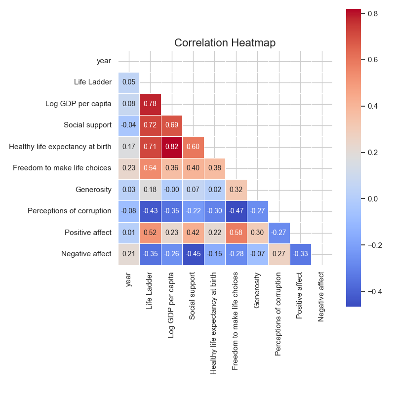
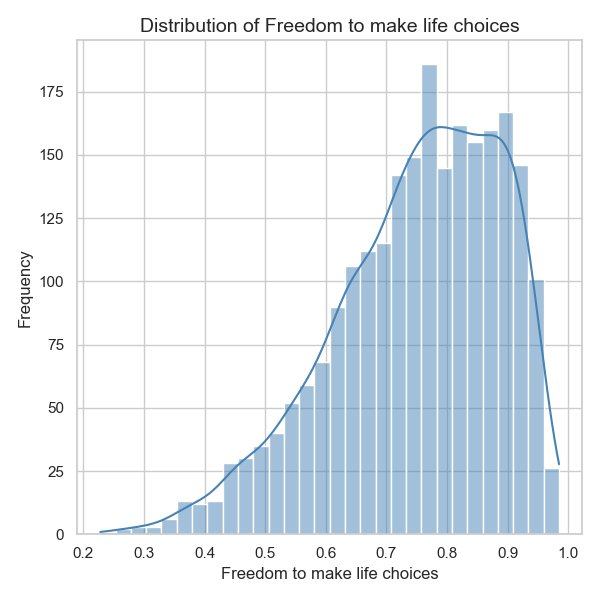
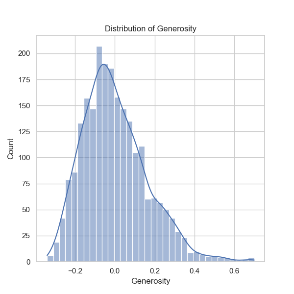
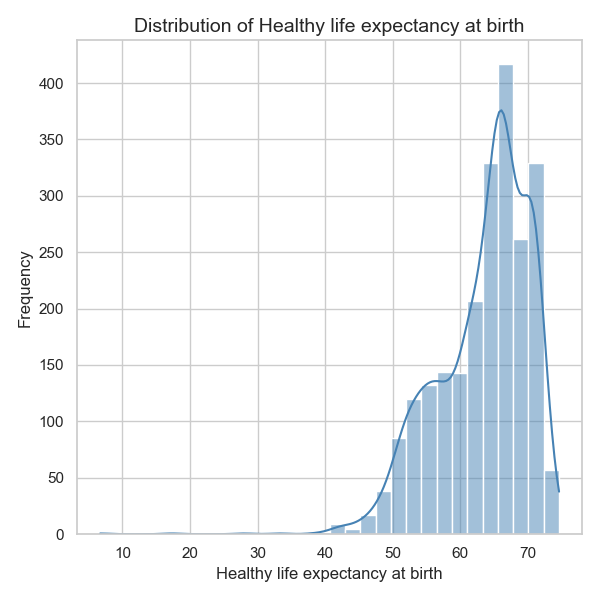
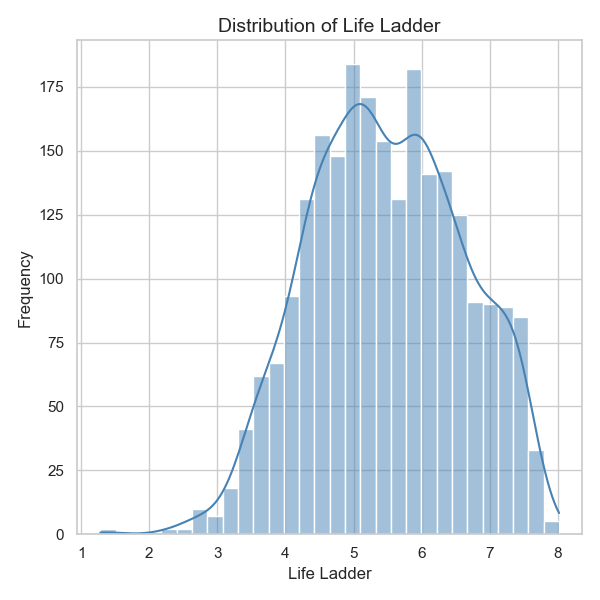
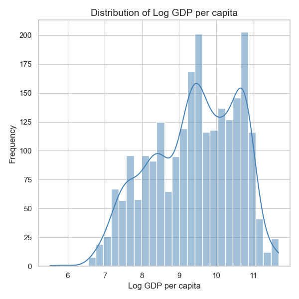
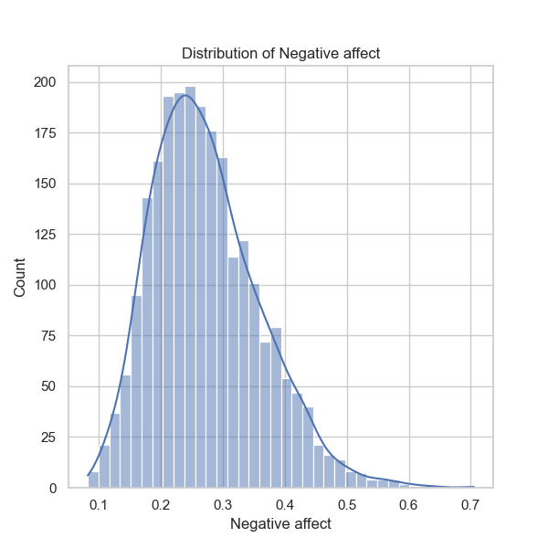
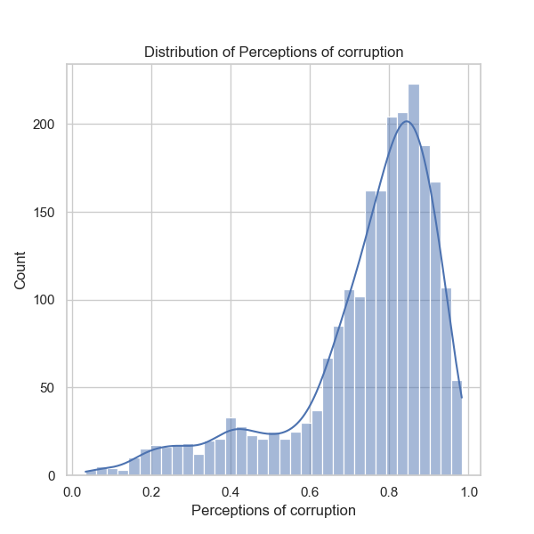
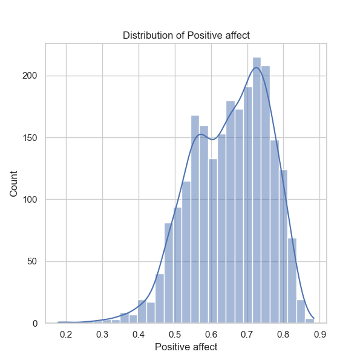
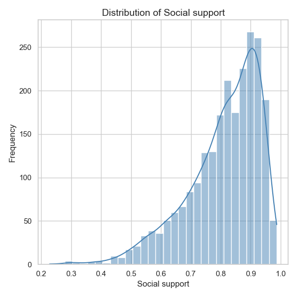
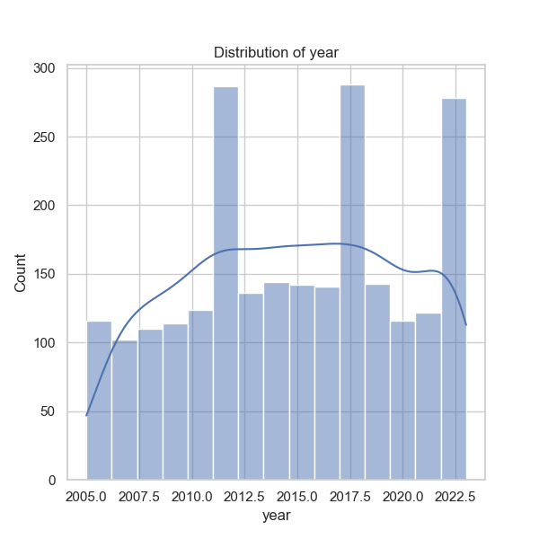