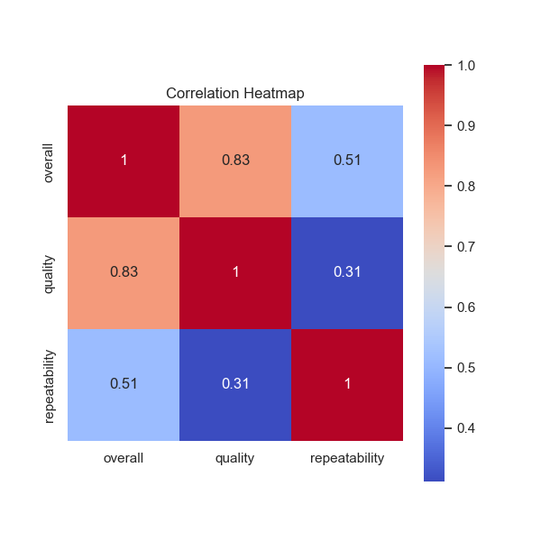
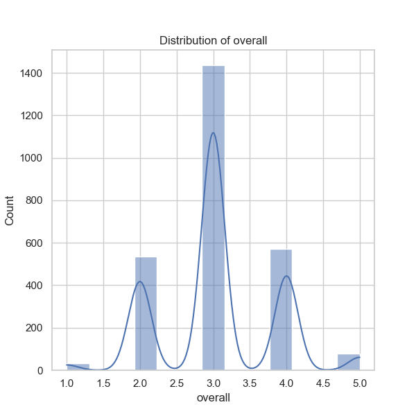
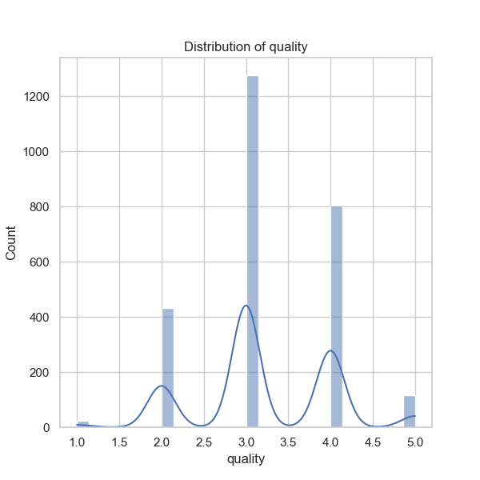
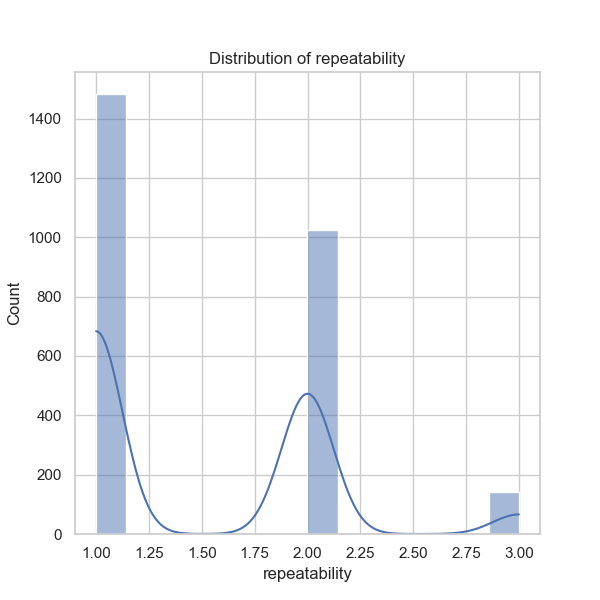

# Data Analysis Report

### Narrative Based on Media Data Analysis

#### Overview
The dataset titled 'media.csv' consists of information about various media entries such as movies, programs, or shows, with a total of 2,652 records. It contains records spread across multiple columns capturing details like the date of release, language of the media, type, title, creator or contributor, overall ratings, quality ratings, and repeatability metrics. 

#### Key Findings

1. **Date Distribution and Missing Values**:
   - The date column contains 2,553 entries, indicating that 99 entries are missing dates, which could affect time-based analyses. Given that '21-May-06' is the most frequent date, it suggests a significant cluster of records possibly related to that release period. Therefore, the analysis may focus heavily on media content from the mid-2000s.
  
2. **Language Diversity**:
   - The language data has 2,652 observations distributed across 11 unique entries. English dominates, with 1,306 entries (almost 49.1%), indicating a potential audience bias or production trend favoring English-language media. Future analytics might explore the remaining languages to capture minority trends or emerging language content.

3. **Types of Media**:
   - The predominant type in the dataset is "movie," accounting for 2,211 entries (about 83.2%). This concentration raises implications about the focus of content production within the dataset and may suggest a market preference for film over other types (e.g., TV shows, documentaries). Further segmentation can identify trends in success rates by media type.

4. **Title Popularity**:
   - There are 2,312 unique titles, with the title "Kanda Naal Mudhal" being the most frequently mentioned (9 instances). This could indicate a particularly successful media piece, urging a deeper dive into its ratings and reception history, as well as why it may resonate with audiences.

5. **Creators and Contributors**:
   - The contributor column has 2,390 non-empty entries with 1,528 unique contributors. “Kiefer Sutherland” stands out as the most notable contributor with 48 entries. Analyzing the contributions associated with Sutherland may illustrate his influence within the dataset and media reception.

6. **Rating Insights**:
   - Ratings reveal some interesting metrics:
     - **Overall Ratings**: The mean rating is approximately 3.05, with a standard deviation of about 0.76, suggesting a slight skew toward higher ratings but with enough variability to indicate mixed quality perceptions among media.
     - **Quality Ratings**: Slightly higher at a mean of 3.21 (std deviation 0.80) implies that while overall ratings hover around average to good, quality perceptions might trend somewhat better.
     - **Repeatability Ratings**: Averaging at 1.49 (std deviation 0.60), this reflects a tendency toward lower repeatability, as indicated by most respondents rating it 1 (rarely or never rewatched), potentially confining the longevity of these titles in viewer preferences.

7. **Correlation Analysis**:
   - A significant correlation (0.83) exists between overall and quality ratings, indicating that higher quality correlates strongly with better overall ratings. The correlation between overall ratings and repeatability (0.51) suggests that while better-rated media are sometimes rewatched, it's not as strong a pattern. The weak correlation between quality and repeatability (0.31) suggests that even high-quality media may not achieve high repeat-watch rates, indicating that quality alone may not guarantee engagement or fanbase sustainability.

#### Trends and Patterns
- **Media Production Period**: The dataset reflects a concentrated period's media output, highlighting trends in types, genres, and audience preferences prevalent during that time.
- **Audience Engagement**: The divergence between quality scores and repeatability suggests consumers are discerning in their media consumption, indicating that novelty might often supersede revisiting content.
- **Potential Biases**: The dominance of English media implies a need for careful consideration of representation for other languages, potentially signaling missed opportunities in capturing diverse audience segments.

#### Recommendations
1. **Further Investigate Missing Dates**: Filling in or analyzing the implications of the missing dates could lend greater insight into release trends.
2. **Explore Lesser-Focused Languages**: Analyzing the media types and their reception in languages other than English could unveil emerging trends.
3. **Examine High-Value Titles**: Titles like "Kanda Naal Mudhal" warrant deeper investigation to understand their success factors, which can inform future content production strategies.
4. **Content Campaigns for Repeatability**: Consider marketing or interactive campaigns that could boost engagement with titles rated highly for quality but low in repeatability.

In conclusion, the media dataset reflects overarching trends that underscore the importance of quality and the niche behaviors of audience engagement, providing a pathway for further inquiry and strategic planning in media content management.

## Visualizations

