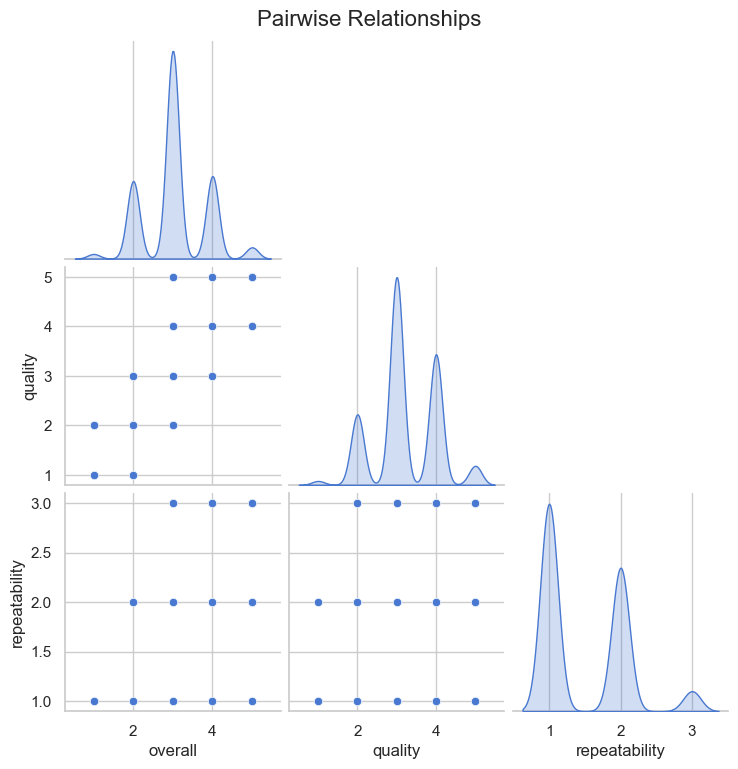

# Data Analysis Report

Based on the analysis of the 'media.csv' dataset, several insights can be drawn regarding the content, trends, and potential areas of interest or concern. Below is a detailed narrative reflecting the findings:

### Dataset Overview
The dataset contains **2,652 entries** covering various media items, with attributes such as the **date of release**, **language**, **type of media**, **title**, **creator**, and ratings for **overall quality**, **perceived quality**, and **repeatability**. 

### Date and Frequency Insights
- **Date Distribution**: The dataset records media items across diverse dates, with a total of **2,053 unique dates**. However, there are **99 missing entries** for the date field, indicating some completeness issues in temporal data.
- **Date Frequency**: The most frequent date recorded is **21-May-06**, appearing **8 times**. This could imply either a significant event, re-release, or clustering of data entries around that period.

### Language Usage
- **Language Concentration**: The entries predominantly use **English**, which appears in **1,306** of the instances (approximately 49.2% of entries). Just **11 unique languages** were identified, highlighting a strong tendency towards English media, which is common in many datasets of this nature.
  
### Media Type Analysis
- **Type of Media**: The dataset heavily favors **movies**, comprising **2,211** entries (about 83.4%). This suggests a possible focus on film media, with other types clearly lesser represented.
- With **only 8 unique types**, potential investigations could look into the popular sub-genre types or formats beyond the predominance of movies.

### Titles and Creators
- **Diversity in Content**: The dataset features **2,312 unique titles** signaling a rich variety in content. However, the title “**Kanda Naal Mudhal**" is notably more common than others, appearing **9 times**, potentially indicating popularity or relevance within certain demographics.
- **Diversity of Creators**: There are **1,528 unique creators** noted but with significant drops in counts, indicating that certain creators, like **Kiefer Sutherland** (appearing **48 times**), possibly dominate the dataset.

### Rating Metrics
The quantitative attributes of the dataset present significant insights:

- **Overall Ratings**: The average overall rating is **3.05** (out of 5), with a standard deviation of **0.76**, indicating a moderate level of satisfaction and a skew towards the positive end of the rating spectrum.
- **Quality Ratings**: A slightly higher average of **3.21** suggests a perception of quality that aligns closely to the overall ratings.
- **Repeatability**: The repeatability average is notably lower at **1.49**, with most entries receiving a repeatability of either **1 or 2**, indicating that these media items might not be frequently revisited by the audience.

### Correlation Insights
- **Strong Relationship**: A substantial correlation of **0.83** between overall ratings and quality signifies that as the perceived quality of media increases, the overall ratings improve correspondingly.
- **Moderate Repeatability Correlations**: While there is also a positive association between overall ratings and repeatability (**0.51**), the lower correlation with quality (**0.31**) suggests that even high-quality items are not guaranteed to be revisited frequently by audiences, calling for further exploration of viewer engagement strategies.

### Missing Values
- There is a notable number of missing values, particularly in the **date** (99 instances) and **creator** (262 instances) fields. This missing data necessitates further attention to ensure comprehensive analysis, especially for temporal trends and creator recognition.

### Conclusions and Future Directions
The findings from 'media.csv' reveal an overarching trend of predominantly English-language movies, with a modest average rating with respect to quality and repeatability. The dataset's richness in unique titles points toward a vast universe of content, though the prevalence of specific creators may suggest a call for deeper exploration of trends in production.

Future analyses could aim to explore:
- Temporal insights to identify trends across years.
- Detailed genre breakdowns to identify underrepresented types.
- Investigation into the relationship between ratings and viewers' demographics to improve engagement.
- Treatments for missing data to enrich the dataset further.

These insights can be of great value for market analysis, content strategy development, and enhancing viewer engagement across the media landscape.

## Visualizations

